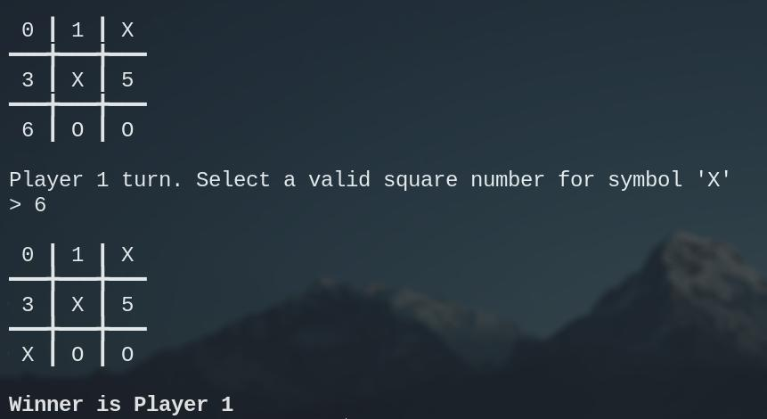

# Tic Tac Toe Game

This is a simple command-line Tic Tac Toe game built with C language. It features a 3x3 board, where two players take turns to place their symbol ('X' or 'O') on an empty cell. The first player to align three of their symbols either horizontally, vertically or diagonally, wins the game. If no player can align their symbols after all cells are filled, the game is a draw.

## Prerequisites

This program requires a C compiler to be installed on your system.

## Getting started

1. Clone this repository to your local machine using `https://github.com/lecoderoid/tictactoe.git`
2. Navigate to the directory containing the cloned repository using the terminal.
3. Compile the program by running the following command: `gcc tictactoe.c -o tictactoe`
4. Run the program using the following command: `./tictactoe`

## How to play

1. After starting the game, you will be presented with the board and asked to select a valid square number for your symbol.
2. Valid square numbers are from 0 to 8, corresponding to the cells on the board.
3. The first player to take a turn will use 'X' as their symbol, and the second player will use 'O'.
4. Players take turns until one of them aligns three of their symbols horizontally, vertically, or diagonally, or until all cells are filled.
5. If a player aligns three of their symbols, they win the game. Otherwise, the game is a draw.

